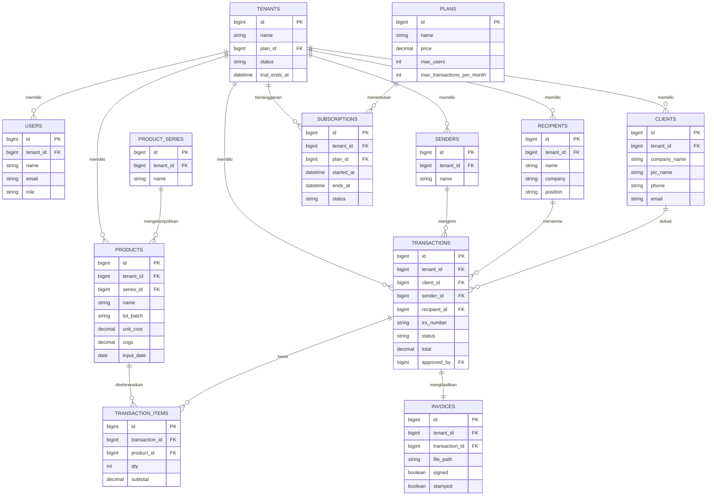

# DOKUMEN ANALISIS SISTEM
## jstock — Platform SaaS Manajemen Inventory

| | |
|---|---|
| **Nama Produk** | jstock |
| **Jenis Platform** | SaaS (Software as a Service), multi-tenant |
| **Tech Stack** | Laravel (Backend/API), ReactJS (Frontend/Client) |
| **Target Pengguna** | Perusahaan distribusi, gudang, dan industri yang butuh tracking barang berbasis LOT/Batch |
| **Versi Dokumen** | v1.0 — Draft Awal |

---

## 1. Ringkasan Eksekutif

jstock adalah platform manajemen inventory berbasis SaaS yang memungkinkan banyak perusahaan (tenant) menggunakan satu sistem yang sama secara independen dan terisolasi satu sama lain. Sistem ini dikembangkan dari kebutuhan riil pengelolaan inventory berbasis LOT/Batch (studi kasus awal: distribusi gas industri), kemudian digeneralisasi menjadi produk yang dapat digunakan lintas industri.

Setiap perusahaan yang mendaftar (tenant/organisasi) mendapatkan ruang kerja terisolasi dengan data klien, data barang, transaksi, invoice, dan laporan masing-masing — tanpa bisa saling melihat data tenant lain.

### 1.1 Konsep Produk SaaS

- **Multi-tenant**: satu instance aplikasi melayani banyak organisasi/perusahaan sekaligus, dengan isolasi data per tenant.
- **Subscription-based**: akses fitur diatur berdasarkan paket langganan (plan) — misalnya Free/Trial, Basic, Pro, Enterprise.
- **Self-service onboarding**: perusahaan baru dapat mendaftar mandiri, membuat organisasi, dan mengundang anggota tim tanpa campur tangan manual dari penyedia platform.
- **Centralized platform management**: pemilik platform (jstock) memiliki panel Super Admin untuk memonitor seluruh tenant, status langganan, dan kesehatan sistem.

### 1.2 Ruang Lingkup Sistem

- Manajemen organisasi/tenant (pendaftaran, langganan, pengaturan perusahaan)
- Manajemen pengguna & peran per tenant (role-based access control)
- Manajemen data klien dan kontak perusahaan (per tenant)
- Manajemen master data barang dengan ID unik (LOT/Batch)
- Pencatatan transaksi barang keluar beserta data pengirim dan penerima
- Kalkulasi otomatis Grand Total Cost dan COGS
- Pembuatan invoice otomatis (auto sign & stamp)
- Pencarian dan filter data berdasarkan Product Series dan tanggal
- Dashboard & laporan per tenant
- Panel Super Admin untuk pengelolaan platform (billing, monitoring tenant)

---

## 2. Arsitektur & Teknologi

### 2.1 Stack Teknologi

| Layer | Teknologi | Keterangan |
|---|---|---|
| Frontend (Client) | ReactJS | SPA, konsumsi REST API, state management (Redux/Zustand/Context), routing (React Router) |
| Backend (Server) | Laravel | REST API, business logic, job queue, scheduler |
| Autentikasi | Laravel Sanctum / JWT | Token-based auth, mendukung multi-device |
| Database | MySQL / PostgreSQL | Relasional, mendukung strategi multi-tenancy |
| Queue & Job | Laravel Queue (Redis/Database driver) | Generate invoice, kirim email, proses async lainnya |
| File Storage | Laravel Filesystem (S3/local) | Simpan invoice PDF, tanda tangan, cap digital |
| Cache | Redis | Session, rate limiting, cache query berat |

### 2.2 Strategi Multi-Tenancy

Dua pendekatan yang umum dipakai — direkomendasikan **Shared Database, Shared Schema dengan `tenant_id`** untuk efisiensi biaya di tahap awal, dengan opsi upgrade ke Database-per-Tenant untuk klien Enterprise:

| Strategi | Kelebihan | Kekurangan |
|---|---|---|
| **Shared DB + `tenant_id`** (Rekomendasi MVP) | Biaya infrastruktur rendah, maintenance mudah, cocok untuk skala kecil-menengah | Perlu disiplin query (global scope) agar data tidak bocor antar tenant |
| Database per Tenant | Isolasi data maksimal, cocok untuk klien Enterprise/compliance ketat | Biaya & kompleksitas maintenance lebih tinggi, migrasi harus dijalankan ke semua DB |

Implementasi di Laravel menggunakan **Global Scope** otomatis (`BelongsToTenant` trait) pada setiap model yang menyaring query berdasarkan `tenant_id` dari user yang sedang login, serta middleware `IdentifyTenant` yang mengikat context tenant di setiap request.

### 2.3 Diagram Arsitektur Tingkat Tinggi

```
[ ReactJS SPA ]  <--HTTPS/JSON-->  [ Laravel API Gateway ]
                                          |
                     +--------------------+--------------------+
                     |                    |                    |
              [ Auth & Tenant ]   [ Business Logic ]     [ Queue Worker ]
              (Sanctum, Scope)    (Inventory, Trx,       (Invoice PDF,
                                   Invoice, Billing)       Email, Report)
                     |                    |                    |
                     +--------------------+--------------------+
                                          |
                          [ MySQL/PostgreSQL + Redis Cache ]
                                          |
                                  [ S3 / File Storage ]
                                  (Invoice, Signature, Stamp)
```

---

## 3. Aktor & Peran Pengguna

Peran dibagi menjadi dua tingkat: **Platform Level** (pengelola jstock) dan **Tenant Level** (pengguna dalam satu organisasi).

### 3.1 Platform Level

| Peran | Akses & Tanggung Jawab |
|---|---|
| Super Admin (jstock) | Kelola seluruh tenant, monitoring langganan & billing, suspend/aktifkan tenant, lihat statistik penggunaan platform |

### 3.2 Tenant Level

| Peran | Akses & Tanggung Jawab |
|---|---|
| Owner/Admin | Full akses dalam tenant: kelola user & role, CRUD semua data, approve transaksi, lihat laporan & COGS, kelola langganan tenant |
| Manager | CRUD data operasional, approve transaksi, lihat laporan & COGS (tanpa kelola billing) |
| Operator | Input data barang, buat transaksi, cetak invoice, search & filter data |
| Viewer | Read-only: lihat data barang, status transaksi, laporan. Tidak bisa input/edit |

### 3.3 Matriks Permission (RBAC)

Selain deskripsi naratif di atas, berikut matriks izin granular per modul. Kode: **C**reate, **R**ead, **U**pdate, **D**elete, **A**pprove, **—** = tidak ada akses.

| Modul | Owner/Admin | Manager | Operator | Viewer |
|---|---|---|---|---|
| Pengaturan Tenant (profil perusahaan) | CRUD | R | — | — |
| User & Role (undang, ubah role, nonaktifkan) | CRUD | R | — | — |
| Subscription & Billing | CRUD | R | — | — |
| Data Klien | CRUD | CRUD | CR | R |
| Data Barang (Master Inventory) | CRUD | CRUD | CR | R |
| LOT/Batch & Product Series | CRUD | CRUD | CR | R |
| Transaksi Barang Keluar (buat/edit draft) | CRUD | CRUD | CR | R |
| Approval Transaksi | A | A | — | — |
| Invoice (generate & download) | CRUD | CR | CR (download) | R (download) |
| Signature & Stamp (template) | CRUD | R | — | — |
| Laporan & COGS | R | R | R (terbatas, tanpa COGS detail) | R (ringkas) |
| Dashboard Summary | R | R | R | R |

**Aturan tambahan:**
- Operator **tidak** bisa menghapus data (`D`) di modul manapun — mencegah kehilangan riwayat transaksi/audit trail.
- Hanya Owner/Admin dan Manager yang bisa meng-*approve* transaksi (peran **A**); Operator hanya bisa membuat & submit.
- Detail COGS (harga pokok) disembunyikan dari Operator dan Viewer karena sensitif secara bisnis — mereka hanya melihat status & ringkasan transaksi.
- Semua permission dievaluasi **dalam scope tenant** — role yang sama di tenant berbeda tidak saling berpengaruh.

### 3.4 Implementasi Teknis RBAC

- **Backend (Laravel)**: gunakan paket [`spatie/laravel-permission`](https://spatie.be/docs/laravel-permission) untuk memetakan role → permission per tenant, dikombinasikan dengan Laravel **Policy** class per model (`ProductPolicy`, `TransactionPolicy`, dst.) untuk otorisasi di level controller/route (`$this->authorize('approve', $transaction)`).
- **Middleware**: `IdentifyTenant` mengikat context tenant, lalu middleware `CheckPermission` memvalidasi apakah role user pada tenant tersebut memiliki permission yang dibutuhkan endpoint.
- **Response API**: payload `user/me` menyertakan daftar `permissions` (array string, misal `["clients.create", "transactions.approve"]`) agar frontend tidak perlu hardcode logika role.
- **Frontend (ReactJS)**: permission dari `user/me` disimpan di context/store, lalu dipakai untuk menyembunyikan/menonaktifkan tombol & route (misal komponen `<Can permission="transactions.approve">`) — namun validasi **utama tetap di backend**, frontend hanya untuk UX.

---

## 4. Proses Bisnis

### 4.1 Onboarding Tenant (Pendaftaran Organisasi Baru)

1. Calon pengguna mendaftar di halaman signup jstock (nama perusahaan, email, password)
2. Sistem membuat akun **Owner** dan **tenant/organisasi baru** dengan `tenant_id` unik
3. Sistem mengaktifkan paket **Trial/Free** secara default
4. Owner melengkapi profil perusahaan (logo, alamat, info tambahan)
5. Owner mengundang anggota tim (Manager, Operator, Viewer) via email invitation
6. Anggota tim menerima email, membuat password, dan bergabung ke tenant tersebut

### 4.2 Manajemen Langganan (Subscription & Billing)

1. Owner membuka modul Billing/Subscription
2. Sistem menampilkan pilihan paket (Free/Basic/Pro/Enterprise) beserta batasan fitur (jumlah user, jumlah transaksi/bulan, storage invoice, dll.)
3. Owner memilih paket dan melakukan pembayaran (integrasi payment gateway, misal Midtrans/Xendit)
4. Sistem mengaktifkan fitur sesuai paket dan mencatat masa berlaku langganan
5. Sistem mengirim notifikasi otomatis menjelang masa langganan berakhir
6. Jika langganan habis tanpa perpanjangan, sistem membatasi akses ke mode read-only atau menonaktifkan sementara

### 4.3 Manajemen Data Klien

1. Owner/Manager/Operator membuka modul Data Klien (dalam scope tenant-nya)
2. Input data: Alamat Klien, Email (opsional), No. Telepon, Nama PT, Nama PIC
3. Sistem menyimpan dan membuat profil klien dengan ID unik (tersimpan dengan `tenant_id`)
4. Data klien tersedia untuk digunakan pada proses transaksi dalam tenant tersebut
5. Owner/Manager dapat mengedit atau menonaktifkan data klien

### 4.4 Manajemen Data Barang (Master Inventory)

1. Operator membuka modul Data Barang
2. Input nama barang (mendukung berbagai format produk sesuai kebutuhan industri masing-masing tenant)
3. Sistem generate atau operator input ID Unik Per Produk (LOT/Batch Number), unik dalam scope tenant
4. Operator melengkapi item detail (harga, satuan, kategori, dll.)
5. Sistem menghitung otomatis Grand Total Cost dan COGS berdasarkan data item
6. Operator mengisi tanggal input barang
7. Sistem menyimpan data dan barang siap digunakan dalam transaksi

### 4.5 Transaksi Barang Keluar

1. Operator membuka modul Transaksi
2. Input ID Barang / scan LOT (Optional) / Batch + ID Unik — sistem highlight dan auto-pull data barang
3. Sistem menampilkan detail barang yang dipilih
4. Operator mengisi Data Pengirim (nama dengan pilihan yang sudah tersedia)
5. Operator mengisi Data Penerima (nama, jabatan, perusahaan penerima)
6. Sistem kalkulasi total dan generate nomor transaksi otomatis
7. Operator submit transaksi untuk approval Manager/Owner
8. Manager/Owner mereview dan meng-approve transaksi
9. Sistem generate Auto Invoice dengan auto sign & stamp
10. Invoice tersedia untuk diunduh/dicetak dalam format PDF
11. Sistem mengurangi kuota transaksi/bulan sesuai paket langganan tenant (jika ada limit)

### 4.6 Fitur-Fitur Sistem

| Fitur | Deskripsi |
|---|---|
| Multi-Tenant Isolation | Data tiap tenant terisolasi penuh, tidak bisa diakses tenant lain |
| Auto Invoice | Generate invoice PDF otomatis setelah transaksi diapprove |
| Auto Sign & Stamp | Tanda tangan dan cap digital otomatis tertempel di invoice (opsional per tenant) |
| Search by Series | Pencarian data barang berdasarkan Product Series / LOT/Batch |
| Filter by Date | Filter riwayat transaksi berdasarkan rentang tanggal |
| COGS Auto-calc | Perhitungan Cost of Goods Sold dilakukan otomatis oleh sistem |
| Highlight Field | Saat input ID barang di transaksi, sistem highlight & tampilkan data |
| Role-Based Access Control | Hak akses granular per peran dalam tenant |
| Subscription Management | Owner dapat upgrade/downgrade paket langganan kapan saja |
| Dashboard & Reporting | Ringkasan stok, transaksi, dan COGS per periode |

---

## 5. Flowchart Sistem (Representasi Tekstual)

### 5.1 Onboarding Tenant Baru

```
[ START ]
  |
[ Calon Pengguna Isi Form Signup ]
  |
[ Sistem Buat Tenant Baru + Akun Owner ]
  |
[ Aktifkan Paket Trial Default ]
  |
[ Owner Lengkapi Profil Perusahaan ]
  |
[ Owner Undang Anggota Tim (opsional) ]
  |
[ END ]
```

### 5.2 Login & Autentikasi (Multi-Tenant)

```
[ START ]
  |
[ User Buka Aplikasi ]
  |
[ Input Email & Password ]
  |
< Validasi Kredensial? >
  NO  --> [ Tampilkan Error, Kembali ke Login ]
  YES
  |
[ Sistem Identifikasi Tenant dari Akun User ]
  |
< Status Langganan Tenant Aktif? >
  NO  --> [ Redirect ke Halaman Billing/Upgrade ]
  YES
  |
[ Cek Role User dalam Tenant ]
  |
[ Tampilkan Dashboard sesuai Role ]
  |
[ END ]
```

### 5.3 Input Data Barang

```
[ START ]
  |
[ Operator Buka Modul Data Barang ]
  |
[ Input Nama Barang ]
  |
[ Input / Generate LOT/Batch + ID Unik (scope tenant) ]
  |
[ Input Item Detail ]
  |
[ Sistem Auto-hitung Grand Total Cost & COGS ]
  |
[ Input Tanggal ]
  |
< Validasi Data Lengkap? >
  YES --> [ Simpan ke Database dengan tenant_id ]
  NO  --> [ Tampilkan Pesan Error ]
  |
[ Barang Tersedia di Master Inventory Tenant ]
  |
[ END ]
```

### 5.4 Transaksi Barang Keluar

```
[ START ]
  |
[ Operator Buka Modul Transaksi ]
  |
[ Input ID Barang / LOT/Batch + ID Unik ]
  |
[ HIGHLIGHT: Sistem Auto-tampilkan Detail Barang ]
  |
< Barang Ditemukan (dalam scope tenant)? >
  NO  --> [ Error: Barang Tidak Ditemukan ]
  YES
  |
[ Input Data Pengirim & Data Penerima ]
  |
[ Sistem Generate Nomor Transaksi & Kalkulasi Total ]
  |
[ Operator Submit -> Menunggu Approval Manager/Owner ]
  |
< Manager/Owner Approve? >
  NO  --> [ Reject, Kirim Notifikasi ke Operator ]
  YES
  |
[ Auto-Generate Invoice PDF + Auto Sign & Stamp ]
  |
[ Update Stok & Catat Riwayat Transaksi ]
  |
[ END ]
```

---

## 6. Skema Data (Ringkas)

Entitas inti dan relasinya (disederhanakan):

```
tenants (id, name, plan_id, status, trial_ends_at, ...)
   └── users (id, tenant_id, name, email, role, ...)
   └── clients (id, tenant_id, name, pic, phone, email, ...)
   └── products (id, tenant_id, name, lot_batch, unit_cost, cogs, ...)
   └── product_series (id, tenant_id, name, ...)
   └── transactions (id, tenant_id, product_id, client_id, sender_id,
                      recipient_id, status, total, approved_by, ...)
   └── invoices (id, tenant_id, transaction_id, file_path, signed, ...)
   └── senders (id, tenant_id, name, ...)
   └── recipients (id, tenant_id, name, company, ...)

plans (id, name, price, max_users, max_transactions_per_month, features_json)
subscriptions (id, tenant_id, plan_id, started_at, ends_at, status)
```

Setiap tabel operasional membawa kolom `tenant_id` dan dijaga oleh Global Scope Laravel agar query otomatis terfilter sesuai tenant user yang login.

### 6.1 ERD Visual



> Catatan: `TRANSACTION_ITEMS` ditambahkan sebagai tabel pivot agar satu transaksi bisa berisi lebih dari satu barang (sesuai endpoint `GET /transactions/{id}/items` pada dokumen API), berbeda dari versi awal dokumen PT RSG yang mengasumsikan satu barang per transaksi.

---

## 7. List Endpoint API

Base URL: `https://api.jstock.id/v1`
Semua endpoint (kecuali auth & platform-admin) beroperasi dalam scope tenant yang teridentifikasi dari token/akun user yang login.

### 7.1 Authentication & Onboarding

| Method | Endpoint | Deskripsi |
|---|---|---|
| POST | /auth/register | Registrasi tenant baru + akun Owner |
| POST | /auth/login | Login user, return token (Sanctum/JWT) |
| POST | /auth/logout | Logout dan invalidasi token |
| POST | /auth/refresh | Refresh access token |
| POST | /auth/forgot-password | Request reset password via email |
| POST | /auth/reset-password | Reset password dengan token dari email |
| POST | /auth/invite | Owner/Manager mengundang anggota tim baru |
| POST | /auth/invite/accept | Anggota tim menerima undangan & set password |

### 7.2 Tenant & User Management

| Method | Endpoint | Deskripsi |
|---|---|---|
| GET | /tenant | Detail profil tenant saat ini |
| PUT | /tenant | Update profil perusahaan (Owner only) |
| GET | /users | List user dalam tenant (Owner/Manager) |
| POST | /users | Tambah user baru dalam tenant |
| GET | /users/{id} | Detail user berdasarkan ID |
| PUT | /users/{id} | Update data user |
| DELETE | /users/{id} | Nonaktifkan user |
| PATCH | /users/{id}/role | Ubah role user (Owner only) |

### 7.3 Subscription & Billing

| Method | Endpoint | Deskripsi |
|---|---|---|
| GET | /plans | List paket langganan yang tersedia |
| GET | /subscription | Status langganan tenant saat ini |
| POST | /subscription/upgrade | Upgrade/downgrade paket langganan |
| POST | /subscription/checkout | Buat sesi pembayaran (payment gateway) |
| POST | /subscription/webhook | Callback dari payment gateway |
| GET | /subscription/invoices | Riwayat invoice langganan (billing tenant) |

### 7.4 Data Klien

| Method | Endpoint | Deskripsi |
|---|---|---|
| GET | /clients | List semua klien dengan pagination |
| POST | /clients | Tambah klien baru |
| GET | /clients/{id} | Detail klien berdasarkan ID |
| PUT | /clients/{id} | Update data klien |
| DELETE | /clients/{id} | Hapus/nonaktifkan klien |
| GET | /clients/search?q={query} | Cari klien by nama PT atau PIC |

### 7.5 Data Barang (Inventory)

| Method | Endpoint | Deskripsi |
|---|---|---|
| GET | /products | List semua barang dengan pagination & filter |
| POST | /products | Tambah barang baru ke inventory |
| GET | /products/{id} | Detail barang berdasarkan ID |
| PUT | /products/{id} | Update data barang |
| DELETE | /products/{id} | Hapus barang dari inventory |
| GET | /products/search | Cari barang (by nama, LOT, series) |
| GET | /products/filter | Filter barang by tanggal input & product series |
| GET | /products/{id}/cost | Ambil kalkulasi Grand Total Cost & COGS |
| POST | /products/{id}/lot | Generate atau input LOT/Batch + ID Unik |

### 7.6 Product Series / LOT-Batch

| Method | Endpoint | Deskripsi |
|---|---|---|
| GET | /product-series | List semua product series |
| POST | /product-series | Tambah product series baru |
| GET | /product-series/{id} | Detail product series |
| GET | /product-series/{id}/products | Semua produk dalam 1 series |
| POST | /lot-batch/generate | Generate LOT/Batch ID otomatis |
| GET | /lot-batch/{lotId} | Cari dan highlight produk by LOT/Batch ID |

### 7.7 Transaksi

| Method | Endpoint | Deskripsi |
|---|---|---|
| GET | /transactions | List semua transaksi (dengan filter tanggal) |
| POST | /transactions | Buat transaksi barang keluar baru |
| GET | /transactions/{id} | Detail transaksi berdasarkan ID |
| PUT | /transactions/{id} | Update transaksi (hanya status DRAFT) |
| DELETE | /transactions/{id} | Batalkan transaksi (Owner/Manager only) |
| PATCH | /transactions/{id}/approve | Approve transaksi |
| PATCH | /transactions/{id}/reject | Reject transaksi + catatan alasan |
| GET | /transactions/filter | Filter transaksi by date, status, product |
| GET | /transactions/{id}/items | List item dalam 1 transaksi |

### 7.8 Pengirim & Penerima

| Method | Endpoint | Deskripsi |
|---|---|---|
| GET | /senders | List semua data pengirim tersimpan |
| POST | /senders | Tambah data pengirim baru |
| GET/PUT | /senders/{id} | Detail / update pengirim |
| GET | /recipients | List semua data penerima tersimpan |
| POST | /recipients | Tambah data penerima baru |
| GET/PUT | /recipients/{id} | Detail / update penerima |

### 7.9 Invoice (Auto Invoice)

| Method | Endpoint | Deskripsi |
|---|---|---|
| GET | /invoices | List semua invoice dengan pagination |
| GET | /invoices/{id} | Detail invoice |
| GET | /invoices/{id}/download | Download invoice PDF (with sign & stamp) |
| POST | /invoices/generate/{transId} | Generate invoice dari transaksi yang di-approve |
| GET | /invoices/transaction/{transId} | Ambil invoice berdasarkan ID transaksi |

### 7.10 Signature & Stamp

| Method | Endpoint | Deskripsi |
|---|---|---|
| GET | /signatures | List semua template tanda tangan |
| POST | /signatures | Upload tanda tangan digital baru |
| DELETE | /signatures/{id} | Hapus tanda tangan |
| GET | /stamps | List semua template cap/stamp |
| POST | /stamps | Upload cap digital baru |
| DELETE | /stamps/{id} | Hapus cap digital |
| PATCH | /stamps/{id}/set-default | Set cap sebagai default |

### 7.11 Laporan & Dashboard

| Method | Endpoint | Deskripsi |
|---|---|---|
| GET | /reports/cogs | Laporan COGS per periode |
| GET | /reports/inventory | Laporan status inventory saat ini |
| GET | /reports/transactions | Laporan rekap transaksi per periode |
| GET | /reports/export | Export laporan ke Excel/PDF |
| GET | /dashboard/summary | Data ringkasan untuk dashboard tenant |

### 7.12 Platform Admin (Super Admin jstock)

| Method | Endpoint | Deskripsi |
|---|---|---|
| GET | /admin/tenants | List seluruh tenant di platform |
| GET | /admin/tenants/{id} | Detail satu tenant |
| PATCH | /admin/tenants/{id}/suspend | Suspend tenant (misal karena tunggakan billing) |
| PATCH | /admin/tenants/{id}/activate | Aktifkan kembali tenant |
| GET | /admin/stats | Statistik penggunaan platform (jumlah tenant, MRR, dsb.) |

### 7.13 Konvensi & Standar API

- **Authentication**: Bearer Token (Laravel Sanctum) di header `Authorization`
- **Tenant Context**: diidentifikasi otomatis dari token user yang login (bukan dari parameter URL, untuk mencegah IDOR antar tenant)
- **Versioning**: semua endpoint menggunakan prefix `/v1/`
- **Response format**: JSON dengan struktur `{ success, data, message, meta }`
- **Pagination**: query params `?page=1&limit=10` untuk semua list endpoint
- **Error codes**: 400 Bad Request | 401 Unauthorized | 403 Forbidden | 404 Not Found | 409 Conflict (limit paket tercapai) | 500 Server Error
- **Rate limiting**: dikonfigurasi per paket langganan (misal Free 60 req/menit, Pro 300 req/menit)
- **CORS**: dikonfigurasi per environment (dev/staging/prod)
- **Logging & Audit Trail**: semua request tercatat, termasuk `tenant_id` dan `user_id` pelaku

---

## 8. Non-Functional Requirements

| Aspek | Kebutuhan |
|---|---|
| Keamanan | Isolasi data antar tenant (query scoping), enkripsi password (bcrypt), HTTPS wajib, rate limiting, audit log |
| Skalabilitas | Horizontal scaling untuk backend Laravel (stateless API), queue worker terpisah untuk proses berat (generate invoice, laporan) |
| Ketersediaan | Target uptime 99.5%, backup database harian per tenant |
| Performa | Response time API < 500ms untuk operasi CRUD standar, caching untuk data yang sering diakses (plan, product series) |
| Kepatuhan | Data klien & transaksi disimpan sesuai kebutuhan retensi masing-masing tenant; opsi export/hapus data saat tenant berhenti berlangganan |

---

## 9. Wireframe UI (Low-Fidelity)

Wireframe berikut menggambarkan tata letak dasar (belum final visual design) untuk 5 layar inti. Tujuannya menyelaraskan struktur informasi sebelum masuk tahap desain UI/UX detail & implementasi React.

### 9.1 Onboarding / Signup Tenant

```
+--------------------------------------------------+
|  jstock                                           |
|                                                    |
|   Daftarkan Perusahaan Anda                       |
|   [ Nama Perusahaan................ ]             |
|   [ Email.......................... ]             |
|   [ Password........................]             |
|                                                    |
|   [        Buat Akun & Mulai Trial        ]       |
|                                                    |
|   Sudah punya akun? Masuk di sini                 |
+--------------------------------------------------+
```

### 9.2 Dashboard (Owner/Manager)

```
+----------+-----------------------------------------------------+
| jstock   |  Dashboard                         [Trial: 12 hari] |
|          |-------------------------------------------------------|
| Dashboard|  [Total Barang]  [Transaksi Bulan Ini]  [COGS Total]  |
| Klien    |     128              46                   Rp 82jt     |
| Barang   |-------------------------------------------------------|
| Transaksi|  Transaksi Terbaru                                    |
| Laporan  |  +----------------------------------------------+     |
| Billing  |  | No. Trx | Klien   | Status    | Total | ...  |     |
+----------+  | TRX-1042| PT ABC  | Approved  | 4.2jt |      |     |
              | TRX-1041| PT XYZ  | Pending   | 1.1jt |      |     |
              +----------------------------------------------+     |
              +-------------------------------------------------------+
```

### 9.3 Data Barang (Master Inventory)

```
+----------+-----------------------------------------------------+
| jstock   |  Data Barang                    [ + Tambah Barang ] |
|          |-------------------------------------------------------|
| ...      |  [ Search nama/LOT... ] [ Filter Series v] [ Tanggal v]|
|          |  +----------------------------------------------+     |
|          |  | Nama Barang     | LOT/Batch | COGS   | Aksi  |     |
|          |  | 8AL 25PPM H2S.. | LOT-2201  | 145.000| Edit  |     |
|          |  | 4AL 50PPM CO..  | LOT-2202  | 98.500 | Edit  |     |
|          |  +----------------------------------------------+     |
|          |  [ < 1 2 3 ... 8 > ]                                  |
+----------+-----------------------------------------------------+
```

### 9.4 Transaksi Barang Keluar (Form)

```
+--------------------------------------------------------------+
|  Transaksi Baru                                               |
|----------------------------------------------------------------|
|  Cari ID Barang / Scan LOT: [......................] [Cari]   |
|                                                                 |
|  >> HIGHLIGHT: 8AL 25PPM H2S/100PPM CO | LOT-2201 | Stok: 40 <<|
|                                                                 |
|  Data Pengirim         Data Penerima                           |
|  [ Nama pengirim v ]   [ Nama penerima....... ]                |
|                        [ Jabatan.............. ]                |
|                        [ Perusahaan........... ]                |
|                                                                 |
|  Total Otomatis: Rp 5.800.000        [ Submit untuk Approval ] |
+--------------------------------------------------------------+
```

### 9.5 Invoice Preview

```
+--------------------------------------------------+
|  [Logo Tenant]          INVOICE #INV-2026-0142    |
|--------------------------------------------------|
|  Kepada: PT ABC Distribusi                        |
|  Tanggal: 02 Sep 2026                             |
|--------------------------------------------------|
|  Barang            Qty   Harga      Subtotal      |
|  8AL 25PPM H2S..    2   2.900.000   5.800.000      |
|--------------------------------------------------|
|                          Grand Total: 5.800.000   |
|                                                    |
|          [Tanda Tangan]      [Cap Digital]        |
|                                                    |
|   [  Download PDF  ]      [  Kirim ke Klien  ]    |
+--------------------------------------------------+
```

> Versi visual (styled) dari wireframe ini tersedia di Artifact terpisah untuk direview bersama tim/klien sebelum masuk tahap desain UI final.

---

## 10. Roadmap Pengembangan (Usulan)

| Fase | Cakupan |
|---|---|
| **MVP (Fase 1)** | Onboarding tenant, auth, manajemen user & role, data klien, data barang, transaksi + approval, auto invoice sederhana |
| **Fase 2** | Subscription & billing (payment gateway), dashboard & laporan, auto sign & stamp, search/filter lanjutan |
| **Fase 3** | Panel Super Admin platform, notifikasi email/in-app, export laporan Excel/PDF, API rate limiting per plan |
| **Fase 4** | Integrasi pihak ketiga (akuntansi, e-signature eksternal), mobile-friendly/PWA, white-label opsional untuk Enterprise |

---

*Dokumen ini bersifat konfidensial dan hanya untuk keperluan pengembangan produk.*
*jstock — Platform SaaS Manajemen Inventory — v1.0 — 2026*
